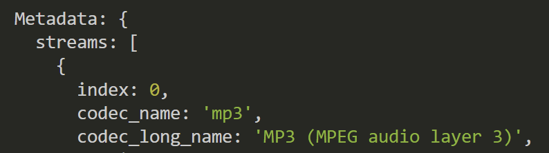
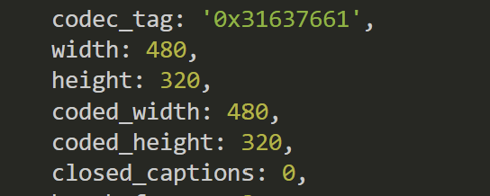

# Introduction

This document serves as a comprehensive test report for the project, detailing the various tests conducted to ensure the system's functionality. The primary objective is to provide an overview of the testing process and document the results of individual tests.

The testing process includes manual tests. Manual tests are designed to verify that the system meets the specified requirements.

The following sections outline the system version, test environment, and detailed test cases, along with their respective statuses and comments. This report aims to provide a clear and concise summary of the testing efforts and their outcomes.

#### **Objective Description**

The goal of this document is to provide an overview of the testing in the 1.0.0 version and document the individual tests.

**Manual Tests**
   * Test cases written to test the system's functionality based on the requirements.
   * Exploratory testing to identify unexpected issues and improvements.

# Test

**System Version**: 1.0.0

**System Test**: Functionality of Methods

**Description of Test Environment**: Computer Windows 10, Google Chrome, Visual Studio Code.

This test covers the 5 implementations.

| Test | Description | Status | Comment |
|------|-------------|:------:|:-------:|
| TC1 | Verify that an mp4 file can be converted to an mp3 file. | 1/OK | 0 |
| TC2 | Verify that an mp3 file's metadata can be shown. | 1/OK | 0 |
| TC3 | Verify that an mp3 file with stereo sound can be converted into an mp3 file with surround sound. | 1/OK | 0 |
| TC4 | Verify that an mp4 video can be downsized by resolution. | 1/OK | 0 |
| TC5 | Verify that an mp4 file's audio can be removed. | 1/OK | 0 |
| COVERAGE & SUCCESS | 5/OK | 0 |

**Improvements**:

* No improvements are needed at the moment.

**Analysis**:

## TC1 Verify that an mp4 file can be converted to an mp3 file.

> #### Instructions
>
> 1. Run Method convertFile() with the file path of a mp4 file as the parameter
> 2. Wait for convertion
> 3. Play the mp3 file and verify that the sound of the mp4 file is the same as the one in the mp3 file.

> #### Expected Outcome
>
> The converted file is a mp3 file with the audio from the specified mp4 file. 

> #### Outcome
> The converted file meets the criterias of the test as the sound of the initial mp4 file is in the mp3 file.

## TC2 Verify that an mp3 file's metadata can be shown.

> #### Instructions
>
> 1. Run Method getMetadata() with the file path of a mp3 file as the parameter
> 2. Look in the console for the metadata object
> 3. Verify that the codec_name is 'mp3'

> #### Expected Outcome
>
> Metadata of mp3 file is logged to the console and codec_name is 'mp3'

> #### Outcome
>The metadata object shows mp3 as shown in below image
> 

## TC3 Verify that an mp3 file with stereo sound can be converted into an mp3 file with surround sound

> #### Instructions
>
> 1. Run Method getMetadata() with the file path of a mp3 file as the parameter
> 2. Verify that the mp3 file has channel_layout 'stereo' and Channels '2'
> 3. Run Method StereoToSurround() with the file path of the mp3 file that has channel_layout 'stereo' and Channels '2' as the parameter.
> 4. Run Method getMetadata() with the file path of the converted mp3 file as the parameter.
> 5. Verify that the converted mp3 has channel_layout '5.1' and Channels '6'.

> #### Expected Outcome
>
> The file converts so that it supports 5.1 surround sound.

> #### Outcome
> The converted file meets the criterias of the test but no tests have been done to verify that the converted file can play 5.1 surround sound. 

## TC4 Verify that an mp4 video can be downsized by resolution.

> #### Instructions
>
> 1. Verify that the mp4 file is being tested is 1920x1080 by running it through getMetadata() and reading width and hight keys in metadata object.
> 2. Run Method resizeVideo() with the file path of a mp4 file as the first parameter, the width of pixels as the secound parameter and the hight of pixels as the third parameter (filepath, 480, 320)
> 3. Run method getMetadata() with the resized video
> 4. Run Method getMetadata() with the file path of the converted mp3 file as the parameter.
> 5. Verify that the converted mp4 file is 480x320 by reading width and hight keys in metadata object.

> #### Expected Outcome
>
> The file is downsized to 480x320 resolution

> #### Outcome
>The file is downsized as shown in below image.
>  

## TC5 Verify that an mp4 file's audio can be removed.

> #### Instructions
>
> 1. Run Method removeAudio() with the file path of a mp4 file as the parameter.
> 2. Play the new mp4 file.
> 3. Verify that the new mp4 has no sound.

> #### Expected Outcome
>
> The new mp4 file has no sound when playing.

> #### Outcome
> The converted file meets the criterias of the test as there is no sound when playing the new mp4 file.

# Known Issues

No critical bugs were found during the testing process. However, the following minor issues were identified:
- The converted mp3 file with surround sound has not been tested for playback in a 5.1 surround sound system.
- When resizing a file at 480x320 back to 1920x1080, the video quality is not the same as the initial state of the 1920x1080 video

# Conclusion
The test for the 1.0.0 version of the program passed without errors.

All the test cases were executed successfully, and the system met all the specified requirements. The functionality methods were thoroughly tested in the described environment, and no issues were encountered. The manual tests, including both predefined test cases and exploratory testing, confirmed that the system operates as expected. 

No critical bugs where found during the testing process.

Overall, the testing process has validated the quality and performance of the program, and it is ready for deployment.